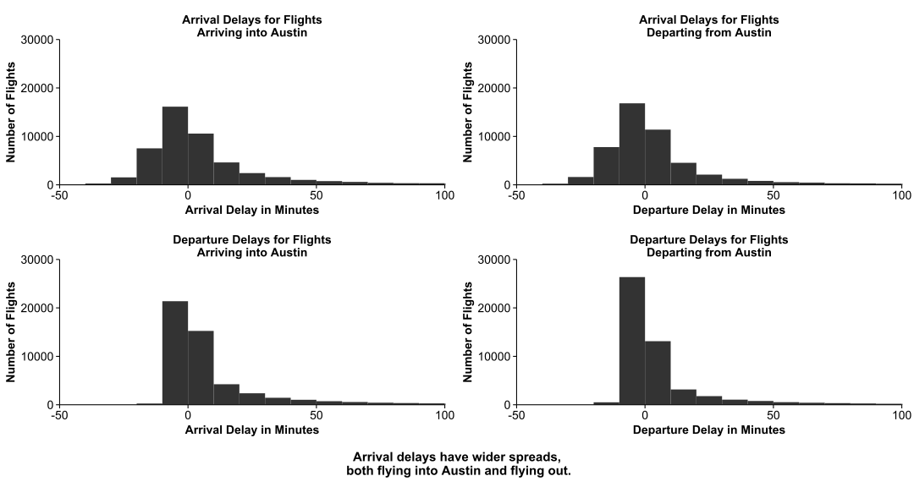
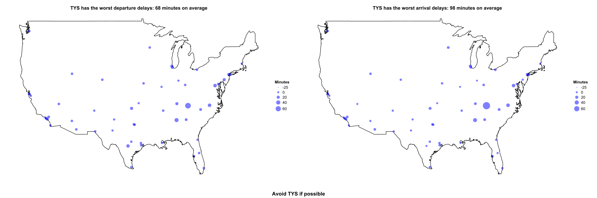
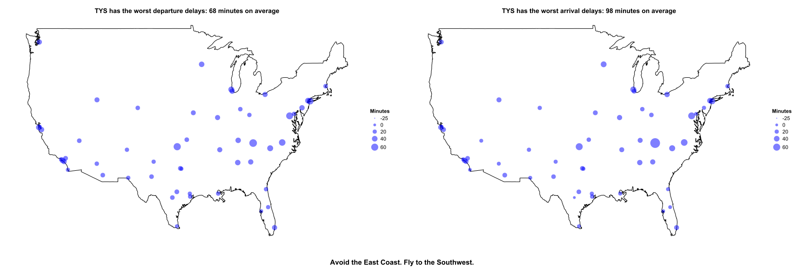

Question 1
==========

### Question: What airports are the worst to fly in/out of?

**For this exercise, we will define the worst airport as the airport with the longest delays.**

Load libraries.

Read in airport data file and longitude/latitude data. Process the data to speed up computations.

``` r
airport<-read.csv("https://raw.githubusercontent.com/jgscott/STA380/master/data/ABIA.csv", header=TRUE)

longlat<-read.socrata ('https://opendata.socrata.com/dataset/Airport-Codes-mapped-to-Latitude-Longitude-in-the-/rxrh-4cxm')

attach(airport)

airportkeep<-c("UniqueCarrier","ArrDelay","DepDelay","Origin","Dest","Cancelled")

airport<-airport[airportkeep]
#Drop variables that are irrelevant for this analysis.
airport$ArrDelay[is.na(airport$ArrDelay)]=0 #Replace NA's (missing delays) with zeros. Assume NA means no delay.

airport$DepDelay[is.na(airport$DepDelay)]=0 #Replace NA's (missing delays) with zeros. Assume NA means no delay.

ll<-subset(longlat, locationID%in%airport$Origin | locationID%in%airport$Dest) #keep the airport codes that are in my dataset

usamap<-map_data("usa") #importing USA map
```

First, create dummy variables to divide the flights into two sets: those departing from Austin and those arriving in Austin. We expect these to have different patterns of delays.

``` r
airport$departing<-"Departing from Austin"
airport$departing[airport$Dest=="AUS"]<-"Arriving into Austin"
airport$departing<-as.factor(airport$departing)
```

Examine the distribution of arrival and departure delays, split by whether flights are arriving into Austin or departing from Austin. We will ignore outliers by zooming in to the area around zero.

We see arrivals have a much wider spread, both for flights departing from and arriving to Austin: More flights arrive earlier than expected and later than expected as opposed to departing earlier than expected and later than expected.

Both the arrival delays and the departure delays have similar enough distributions for flights into Austin and out of Austin that we can safely consider them together rather than separately.

``` r
ggarrivalin<-ggplot(data=subset(airport,departing=="Arriving into Austin"))+geom_histogram(aes(x=ArrDelay), binwidth=10)+ coord_cartesian(xlim = c(-50,100),ylim=c(0,30000)) + labs(title="Arrival Delays for Flights\nArriving into Austin", x="Arrival Delay in Minutes", y="Number of Flights")

ggarrivalout<-ggplot(data=subset(airport,departing=="Departing from Austin"))+geom_histogram(aes(x=ArrDelay), binwidth=10)+ coord_cartesian(xlim = c(-50,100),ylim=c(0,30000)) + labs(title="Arrival Delays for Flights\nDeparting from Austin", x="Departure Delay in Minutes", y="Number of Flights")

ggdeparturein<-ggplot(data=subset(airport,departing=="Arriving into Austin"))+geom_histogram(aes(x=DepDelay), binwidth=10)+ coord_cartesian(xlim = c(-50,100),ylim=c(0,30000)) + labs(title="Departure Delays for Flights\nArriving into Austin", x="Arrival Delay in Minutes", y="Number of Flights")

ggdepartureout<-ggplot(data=subset(airport,departing=="Departing from Austin"))+geom_histogram(aes(x=DepDelay), binwidth=10)+ coord_cartesian(xlim = c(-50,100),ylim=c(0,30000)) + labs(title="Departure Delays for Flights\nDeparting from Austin", x="Departure Delay in Minutes", y="Number of Flights")

g<-plot_grid(ggarrivalin, ggarrivalout, ggdeparturein, ggdepartureout, ncol=2)

ggdraw(add_sub(g,label="Arrival delays have wider spreads,\n both flying into Austin and flying out.",x=.5,y=.5,vpadding=grid::unit(2,"lines"),fontface="bold",size=15))
```



Calculate average arrival and departure delays by airport.

``` r
airportagg<-ddply(airport,.(Origin), summarize, AvgArrDelay=mean(ArrDelay), AvgDepDelay=mean(DepDelay))
airportagg<-merge(airportagg, ll, by.x="Origin", by.y="locationID")
```

Create graphs. The worst departure delays overall (both for flights arriving at Austin and departing from Austin) are in the mid-Atlantic region, with TYS (in Knoxville) being a clear outlier. We see similar patterns for arrival delays. TYS is still by far the worst, and the mid-Atlantic region still tends higher than everywhere else.

``` r
airportagg$Longitude=-(airportagg$Longitude) #uniformizing longitude between dataset and map

ggdep<-ggplot(airportagg) + geom_map(data=usamap, map = usamap, aes(map_id=region,x=long,y=lat), fill="white", color="black") + geom_point(aes(x=Longitude,y=Latitude,size=AvgDepDelay),alpha=.5,color="blue")+ggtitle(paste0(airportagg$Origin[which.max(airportagg$AvgDepDelay)], " has the worst departure delays: ", round(airportagg$AvgDepDelay[which.max(airportagg$AvgDepDelay)],0), " minutes on average")) + scale_size_continuous("Minutes",breaks=c(-25,0,20,40,60), labels=c(-25,0,20,40,60), limits=c(-25,100), range=c(1,10))+theme(axis.line=element_blank(), axis.text=element_blank(),axis.ticks=element_blank(), axis.title=element_blank())

ggarr<-ggplot(airportagg) + geom_map(data=usamap, map = usamap, aes(map_id=region,x=long,y=lat), fill="white", color="black") + geom_point(aes(x=Longitude,y=Latitude,size=AvgArrDelay),alpha=.5,color="blue")+ggtitle(paste0(airportagg$Origin[which.max(airportagg$AvgArrDelay)], " has the worst arrival delays: ", round(airportagg$AvgArrDelay[which.max(airportagg$AvgArrDelay)],0), " minutes on average"))+ scale_size_continuous("Minutes",breaks=c(-25,0,20,40,60), labels=c(-25,0,20,40,60), limits=c(-25,100), range=c(1,10))+theme(axis.line=element_blank(), axis.text=element_blank(),axis.ticks=element_blank(), axis.title=element_blank())

q<-plot_grid(ggdep,ggarr)

ggdraw(add_sub(q,label="Avoid TYS if possible",x=.5,y=.5,vpadding=grid::unit(1,"lines"),fontface="bold",size=15))
```



While we have seen the results aggregated over all flights, we may also want to consider only what happends when a flight is in fact delayed. In other words, which airport most quickly resolves delays? We filter by only departure delays so we retain all the flights that made up for the delay. TYS is still the worst, but many other big airports on the East Coast (as well as OKC) take about an hour to resolve departure delays. Southwestern airports only take about 20 minutes to resolve delays.

``` r
airport_delays<-subset(airport,DepDelay>0)

airportagg<-ddply(airport_delays,.(Origin), summarize, AvgArrDelay=mean(ArrDelay), AvgDepDelay=mean(DepDelay))
airportagg<-merge(airportagg, ll, by.x="Origin", by.y="locationID")

airportagg$Longitude=-(airportagg$Longitude)

ggdep<-ggplot(airportagg) + geom_map(data=usamap, map = usamap, aes(map_id=region,x=long,y=lat), fill="white", color="black") + geom_point(aes(x=Longitude,y=Latitude,size=AvgDepDelay),alpha=.5,color="blue")+ggtitle(paste0(airportagg$Origin[which.max(airportagg$AvgDepDelay)], " has the worst departure delays: ", round(airportagg$AvgDepDelay[which.max(airportagg$AvgDepDelay)],0), " minutes on average")) + scale_size_continuous("Minutes",breaks=c(-25,0,20,40,60), labels=c(-25,0,20,40,60), limits=c(-25,100), range=c(1,10))+theme(axis.line=element_blank(), axis.text=element_blank(),axis.ticks=element_blank(), axis.title=element_blank())

ggarr<-ggplot(airportagg) + geom_map(data=usamap, map = usamap, aes(map_id=region,x=long,y=lat), fill="white", color="black") + geom_point(aes(x=Longitude,y=Latitude,size=AvgArrDelay),alpha=.5,color="blue")+ggtitle(paste0(airportagg$Origin[which.max(airportagg$AvgArrDelay)], " has the worst arrival delays: ", round(airportagg$AvgArrDelay[which.max(airportagg$AvgArrDelay)],0), " minutes on average"))+ scale_size_continuous("Minutes",breaks=c(-25,0,20,40,60), labels=c(-25,0,20,40,60), limits=c(-25,100), range=c(1,10))+theme(axis.line=element_blank(), axis.text=element_blank(),axis.ticks=element_blank(), axis.title=element_blank())

q<-plot_grid(ggdep,ggarr)

ggdraw(add_sub(q,label="Avoid the East Coast. Fly to the Southwest.",x=.5,y=.5,vpadding=grid::unit(1,"lines"),fontface="bold",size=15))
```



### Summary

The worst airport with regards to delays is TYS (Knoxville). However, the East Coast in general has trouble with delays. Southwestern cities handle delays particularly well.

Question 2
==========

### Creating a Dense Document Term Matrix

Import necessary libraries and source necessary functions.

Import data and create a corpus.

``` r
author_dirs = Sys.glob('../data/ReutersC50/C50train/*')
file_list = NULL
labels = NULL
for(author in author_dirs) {
    author_name = substring(author, first=29)
    files_to_add = Sys.glob(paste0(author, '/*.txt'))
    file_list = append(file_list, files_to_add)
    labels = append(labels, rep(author_name, length(files_to_add)))
}

all_docs = lapply(file_list, readerPlain) 
names(all_docs) = file_list
names(all_docs) = sub('.txt', '', names(all_docs))
my_corpus = Corpus(VectorSource(all_docs))
names(my_corpus) = labels
```

Preprocess the corpus.

``` r
my_corpus = tm_map(my_corpus, content_transformer(tolower)) # make everything lowercase
my_corpus = tm_map(my_corpus, content_transformer(removeNumbers)) # remove numbers
my_corpus = tm_map(my_corpus, content_transformer(removePunctuation)) # remove punctuation
my_corpus = tm_map(my_corpus, content_transformer(stripWhitespace)) ## remove excess white-space
my_corpus = tm_map(my_corpus, content_transformer(removeWords), stopwords("en")) #remove basic English stopwords
my_corpus = tm_map(my_corpus, stemDocument) #stem document
```

Create a document term matrix, remove sparse terms, and create a dense matrix. Also, create a vector of training set authors

``` r
DTM = DocumentTermMatrix(my_corpus) #create a document term matrix
DTM = removeSparseTerms(DTM, 0.996) #remove words that are in ten or fewer documents
X = as.matrix(DTM) #create a dense matrix
authors=rownames(X) #create a vector of training set author names
```

Create a document term matrix and author list for the test set.

``` r
author_dirs = Sys.glob('../data/ReutersC50/C50test/*')
file_list = NULL
labels = NULL
for(author in author_dirs) {
    author_name = substring(author, first=28)
    files_to_add = Sys.glob(paste0(author, '/*.txt'))
    file_list = append(file_list, files_to_add)
    labels = append(labels, rep(author_name, length(files_to_add)))
}

all_docs = lapply(file_list, readerPlain) 
names(all_docs) = file_list
names(all_docs) = sub('.txt', '', names(all_docs))
my_corpus_test = Corpus(VectorSource(all_docs))
names(my_corpus_test) = labels

my_corpus_test = tm_map(my_corpus_test, content_transformer(tolower)) # make everything lowercase
my_corpus_test = tm_map(my_corpus_test, content_transformer(removeNumbers)) # remove numbers
my_corpus_test = tm_map(my_corpus_test, content_transformer(removePunctuation)) # remove punctuation
my_corpus_test = tm_map(my_corpus_test, content_transformer(stripWhitespace)) ## remove excess white-space
my_corpus_test = tm_map(my_corpus_test, content_transformer(removeWords), stopwords("en")) #remove basic English stopwords
my_corpus_test = tm_map(my_corpus_test, stemDocument) #stem document

DTM_test = DocumentTermMatrix(my_corpus_test) #create a document term matrix
DTM_test = removeSparseTerms(DTM_test, 0.996) #remove words that are in ten or fewer documents
X_test = as.matrix(DTM_test)
authors_test=rownames(X_test)
```

We need to handle words that are in the test set but not in our training set. We will drop them out of our test set because they do not help our model's predictions. We must similarly handle words that are in the training set but not in the test set so our multiplication works. We will add columns of zeros to the test columns.

``` r
X_names<-colnames(X)
X_test_names<-colnames(X_test)

drop_list<-vector(length=0) #initialize a vector of words to drop out of test
zero_list<-vector(length=0) #initialize a vector of words to drop out of train

for (stem in X_test_names)  { #find word stems that are in test but not in train
  if (!stem %in% X_names) {
    drop_list<-c(drop_list,stem)
  }
}

X_test_mod<-X_test[,!colnames(X_test) %in% drop_list] #drop words from test that are in test but not in train

for (stem in X_names)  { #find words that are in train but not in test
  if (!stem %in% X_test_names) {
    zero_list<-c(zero_list,stem)
  }
}

#add columns of zeros to test for words that are in train but not in test
zeroes<-matrix(0,dim(X_test)[1],length(zero_list))
colnames(zeroes)<-zero_list
X_test_mod<-cbind(zeroes,X_test_mod)
X_test_mod<-X_test_mod[,order(colnames(X_test_mod))]
```

### Model 1: Naive Bayes

*This model assumes words are independently distributed.*

Calculate logged multinomial probability vectors for each author.

``` r
smooth_count=1/nrow(X)
byauthor=rowsum(X+smooth_count, authors) #sum word counts for individual words by author
w=rowSums(byauthor) #sum total word count by author
w_author=log(byauthor/w) #avoid underflow
```

We multiply the modified test DTM by the transposed modified multinomial probability matrix to arrive at a matrix of documents with Naive Bayes scores per author.

``` r
nbscores<-X_test_mod%*%t(w_author)
```

We create a comparison matrix of the Naive Bayes prediction (the author with the highest logged probabilities per document) versus the actual author.

``` r
nbprediction<-colnames(nbscores)[max.col(nbscores)] #highest logged probability
nbcorrect<-as.integer(nbprediction==authors_test) #does prediction match actual?
correct_matrix<-cbind.data.frame(authors_test,nbprediction,nbcorrect) #cbind
```

This model correctly predicts the author about 64% of the time across the entire test set.

``` r
mean(nbcorrect)
```

    ## [1] 0.6388

### Model 2: Multinomial Logistic Regression Using Principal Components

**Our Naive Bayes model assumes that word counts are not correlated. This model allows us to relax that assumption. Because we have so many more features than observations, we will use principal components to reduce the number of features and thus the variance of our final prediction. We will cross-validate to choose the number of principal components we use to build our model.**

We run principal a principal components and cross-validate over a sequence of k's (number of principal components) to choose which k to use to build our final model.

``` r
set.seed(1234)

train<-createDataPartition(y = authors, p=0.5, times=1, list = FALSE) #divide the training set into two stratified datasets for cross-validation purposes

CV_train<-X[train,]
CV_test<-X[-train,]
y_train<-as.factor(authors[train])
y_test<-as.factor(authors[-train])

q<-c(2,10,100,seq(250,1000,250)) #create a sequence of k's over which to cross-validate

mean<-numeric(length=length(q)) #create an empty vector to store the accuracy rates

counter=1 #initialize a counter to ensure the means vector is accurately filled out.

pc<-prcomp(CV_train) #run a principal components analysis on the cross-validation training set.

#calculate the accuracy over the sequence of k's
for (n in q) {
  scores<-pc$x[,1:n]
  glm<-glmnet(y=y_train, x=scores, family="multinomial", alpha=0)
  loading<-pc$rotation[,1:n]
  CV_test_scores<-CV_test%*%loading
  predict<-predict(glm,newx=CV_test_scores,type="class",s=0)
  mean[counter]=mean(as.integer(y_test==predict))
  counter=counter+1
}

CV_error=cbind.data.frame(q,mean)

CV_error[which.max(CV_error$mean),] #find the k with the highest accuracy
```

    ##     q   mean
    ## 6 750 0.7672

We see that 500 principal components has the highest accuracy. We will use this to build our full model.

``` r
pc<-prcomp(X) #run principal components analysis on the entire training dataset.
X_scores<-pc$x[,1:500] #use the first 500 principal components
glm<-glmnet(y=authors,x=X_scores,family="multinomial",alpha=0) #fit a multinomial logistic regression.
```

We transform our test matrix.

``` r
loading<-pc$rotation[,1:500] #the loadings of the first 500 principal components
X_test_scores<-X_test_mod%*%loading #transform test matrix
mlrpredict<-predict(glm,newx=X_test_scores,type="class",s=0) #predictions
```

We add these predictions and correctness measures to our correct matrix.

``` r
mlrcorrect<-as.integer(mlrpredict==authors_test) #does prediction match actual?
correct_matrix<-cbind.data.frame(correct_matrix,mlrpredict,mlrcorrect)
```

This model has an accuracy of 63%, which is similar to our Naive Baye's model.

``` r
mean(mlrcorrect)
```

    ## [1] 0.6324

### Summary

I prefer the Naive Bayes model. Although PCA multinomial logistic regression and Naive Bayes have similar accuracy scores, Naive Bayes is a simpler, more interpretable model that requires fewer computing resources and less time.

The Naive Bayes model particularly struggles with the following authors. They all have accuracy scores under 50%: Fewer than 50% of their articles are correctly attributed to them.

``` r
final <- ddply(correct_matrix, .(authors_test), transform, sum.n = length(authors_test))
xtab<-ddply(final, .(authors_test, nbprediction), summarise,number = length(nbprediction), proportion = number / sum.n[1] * 100)
poor.prediction<-xtab[xtab$authors_test==xtab$nbprediction & xtab$proportion<50,]
poor.prediction #number and proportion refer to the number and proportion of predictions for that predicted author and that actual author
```

    ##         authors_test     nbprediction number proportion
    ## 10    AlexanderSmith   AlexanderSmith     23         46
    ## 15   BenjaminKangLim  BenjaminKangLim     13         26
    ## 39  DarrenSchuettler DarrenSchuettler     11         22
    ## 44       DavidLawder      DavidLawder      7         14
    ## 72  HeatherScoffield HeatherScoffield     22         44
    ## 83     JaneMacartney    JaneMacartney     20         40
    ## 213       MureDickie       MureDickie     17         34
    ## 278      ScottHillis      ScottHillis      9         18
    ## 291         TanEeLyn         TanEeLyn     15         30
    ## 310       ToddNissen       ToddNissen     22         44
    ## 321     WilliamKazer     WilliamKazer     16         32

We further examine these authors to see if particular pairs of authors give our Naive Bayes model particular difficulty. The following pairs are often confused. At least 20% (10 documents) of the actual author's documents are misclassifed as the predicted author's works.

``` r
xtab[xtab$authors_test %in% poor.prediction$authors_test & xtab$number>10 & xtab$authors_test!=xtab$nbprediction,]
```

    ##         authors_test     nbprediction number proportion
    ## 11    AlexanderSmith         JoeOrtiz     22         44
    ## 17   BenjaminKangLim    JaneMacartney     13         26
    ## 40  DarrenSchuettler HeatherScoffield     36         72
    ## 48       DavidLawder       ToddNissen     27         54
    ## 85     JaneMacartney      ScottHillis     20         40
    ## 219       MureDickie     WilliamKazer     11         22
    ## 274      ScottHillis    JaneMacartney     24         48
    ## 288         TanEeLyn    PeterHumphrey     20         40
    ## 289         TanEeLyn     SarahDavison     11         22
    ## 304       ToddNissen      DavidLawder     12         24

The MLR model has trouble with the same authors, but it misclassifies most of them across a range of other authors. Only JaneMaCartney and TanEelyn show a high percentage of documents misclassified as by one particular other author (Heather Scoffield and Aaron Pressman, respectively).

``` r
final <- ddply(correct_matrix, .(authors_test), transform, sum.n = length(authors_test))

xtab<-ddply(final, .(authors_test, mlrpredict), summarise,number = length(mlrpredict), proportion = number / sum.n[1] * 100)

poor.prediction<-xtab[xtab$authors_test==xtab$mlrpredict & xtab$proportion<50,]

poor.prediction #number and proportion refer to the number and proportion of predictions for that predicted author and that actual author
```

    ## [1] authors_test mlrpredict   number       proportion  
    ## <0 rows> (or 0-length row.names)

``` r
levels(xtab$mlrpredict)<-levels(xtab$authors_test)

xtab[xtab$authors_test %in% poor.prediction$authors_test & xtab$number>10 & xtab$authors_test!=xtab$mlrpredict,]
```

    ## [1] authors_test mlrpredict   number       proportion  
    ## <0 rows> (or 0-length row.names)

Problem 3
=========

Read data files and create transactions object.

Run apriori algorithm with low support and low confidence: These levels let us inspect different subsets without rerunning the apriori algorithm.

### Support=.01 and Confidence=0.5

These choices mean that rarer purchases and weaker relationships are dropped. At these levels, we see that purchases of whole milk are strongly associated with purchases of produce and other dairy, even after accounting for whole milk's relative abundance in our data.

``` r
inspect(subset(groceriesrules, subset=support>.01&confidence>.5))
```

    ##    lhs                     rhs                   support confidence     lift
    ## 1  {curd,                                                                   
    ##     yogurt}             => {whole milk}       0.01006609  0.5823529 2.279125
    ## 2  {butter,                                                                 
    ##     other vegetables}   => {whole milk}       0.01148958  0.5736041 2.244885
    ## 3  {domestic eggs,                                                          
    ##     other vegetables}   => {whole milk}       0.01230300  0.5525114 2.162336
    ## 4  {whipped/sour cream,                                                     
    ##     yogurt}             => {whole milk}       0.01087951  0.5245098 2.052747
    ## 5  {other vegetables,                                                       
    ##     whipped/sour cream} => {whole milk}       0.01464159  0.5070423 1.984385
    ## 6  {other vegetables,                                                       
    ##     pip fruit}          => {whole milk}       0.01352313  0.5175097 2.025351
    ## 7  {citrus fruit,                                                           
    ##     root vegetables}    => {other vegetables} 0.01037112  0.5862069 3.029608
    ## 8  {root vegetables,                                                        
    ##     tropical fruit}     => {other vegetables} 0.01230300  0.5845411 3.020999
    ## 9  {root vegetables,                                                        
    ##     tropical fruit}     => {whole milk}       0.01199797  0.5700483 2.230969
    ## 10 {tropical fruit,                                                         
    ##     yogurt}             => {whole milk}       0.01514997  0.5173611 2.024770
    ## 11 {root vegetables,                                                        
    ##     yogurt}             => {whole milk}       0.01453991  0.5629921 2.203354
    ## 12 {rolls/buns,                                                             
    ##     root vegetables}    => {other vegetables} 0.01220132  0.5020921 2.594890
    ## 13 {rolls/buns,                                                             
    ##     root vegetables}    => {whole milk}       0.01270971  0.5230126 2.046888
    ## 14 {other vegetables,                                                       
    ##     yogurt}             => {whole milk}       0.02226741  0.5128806 2.007235

### Support\>.005 and Confidence\>0.2 and Lift\>2

These choices mean that rarer purchases will still be dropped, but weaker relationships will be kept. The lift parameter ensures that very weak relationships are still dropped. At these levels, we see that a variety of grocery items--dairy, fruits, and meats--are associated with the purchase of root vegetables. Furthermore, we also see that buying any type of dairy (especially in conjunction with a produce item) is associated with buying another type, a relationship that corroborates our earlier findings.

``` r
inspect(subset(groceriesrules, subset=support>.01&confidence>0.2&lift>2))
```

    ##    lhs                        rhs                     support confidence     lift
    ## 1  {onions}                => {other vegetables}   0.01423488  0.4590164 2.372268
    ## 2  {berries}               => {yogurt}             0.01057448  0.3180428 2.279848
    ## 3  {hamburger meat}        => {other vegetables}   0.01382816  0.4159021 2.149447
    ## 4  {cream cheese }         => {yogurt}             0.01240468  0.3128205 2.242412
    ## 5  {chicken}               => {root vegetables}    0.01087951  0.2535545 2.326221
    ## 6  {chicken}               => {other vegetables}   0.01789527  0.4170616 2.155439
    ## 7  {frozen vegetables}     => {root vegetables}    0.01159126  0.2410148 2.211176
    ## 8  {beef}                  => {root vegetables}    0.01738688  0.3313953 3.040367
    ## 9  {curd}                  => {yogurt}             0.01728521  0.3244275 2.325615
    ## 10 {pork}                  => {root vegetables}    0.01362481  0.2363316 2.168210
    ## 11 {butter}                => {root vegetables}    0.01291307  0.2330275 2.137897
    ## 12 {domestic eggs}         => {root vegetables}    0.01433655  0.2259615 2.073071
    ## 13 {whipped/sour cream}    => {root vegetables}    0.01708185  0.2382979 2.186250
    ## 14 {whipped/sour cream}    => {yogurt}             0.02074225  0.2893617 2.074251
    ## 15 {whipped/sour cream}    => {other vegetables}   0.02887646  0.4028369 2.081924
    ## 16 {pip fruit}             => {tropical fruit}     0.02043721  0.2701613 2.574648
    ## 17 {citrus fruit}          => {tropical fruit}     0.01992883  0.2407862 2.294702
    ## 18 {tropical fruit}        => {yogurt}             0.02928317  0.2790698 2.000475
    ## 19 {yogurt}                => {tropical fruit}     0.02928317  0.2099125 2.000475
    ## 20 {root vegetables}       => {other vegetables}   0.04738180  0.4347015 2.246605
    ## 21 {other vegetables}      => {root vegetables}    0.04738180  0.2448765 2.246605
    ## 22 {curd,                                                                        
    ##     yogurt}                => {whole milk}         0.01006609  0.5823529 2.279125
    ## 23 {curd,                                                                        
    ##     whole milk}            => {yogurt}             0.01006609  0.3852140 2.761356
    ## 24 {pork,                                                                        
    ##     whole milk}            => {other vegetables}   0.01016777  0.4587156 2.370714
    ## 25 {butter,                                                                      
    ##     other vegetables}      => {whole milk}         0.01148958  0.5736041 2.244885
    ## 26 {butter,                                                                      
    ##     whole milk}            => {other vegetables}   0.01148958  0.4169742 2.154987
    ## 27 {domestic eggs,                                                               
    ##     other vegetables}      => {whole milk}         0.01230300  0.5525114 2.162336
    ## 28 {domestic eggs,                                                               
    ##     whole milk}            => {other vegetables}   0.01230300  0.4101695 2.119820
    ## 29 {fruit/vegetable juice,                                                       
    ##     whole milk}            => {other vegetables}   0.01047280  0.3931298 2.031756
    ## 30 {whipped/sour cream,                                                          
    ##     yogurt}                => {other vegetables}   0.01016777  0.4901961 2.533410
    ## 31 {other vegetables,                                                            
    ##     whipped/sour cream}    => {yogurt}             0.01016777  0.3521127 2.524073
    ## 32 {other vegetables,                                                            
    ##     yogurt}                => {whipped/sour cream} 0.01016777  0.2341920 3.267062
    ## 33 {whipped/sour cream,                                                          
    ##     yogurt}                => {whole milk}         0.01087951  0.5245098 2.052747
    ## 34 {whipped/sour cream,                                                          
    ##     whole milk}            => {yogurt}             0.01087951  0.3375394 2.419607
    ## 35 {whipped/sour cream,                                                          
    ##     whole milk}            => {other vegetables}   0.01464159  0.4542587 2.347679
    ## 36 {other vegetables,                                                            
    ##     pip fruit}             => {whole milk}         0.01352313  0.5175097 2.025351
    ## 37 {pip fruit,                                                                   
    ##     whole milk}            => {other vegetables}   0.01352313  0.4493243 2.322178
    ## 38 {citrus fruit,                                                                
    ##     root vegetables}       => {other vegetables}   0.01037112  0.5862069 3.029608
    ## 39 {citrus fruit,                                                                
    ##     other vegetables}      => {root vegetables}    0.01037112  0.3591549 3.295045
    ## 40 {other vegetables,                                                            
    ##     root vegetables}       => {citrus fruit}       0.01037112  0.2188841 2.644626
    ## 41 {citrus fruit,                                                                
    ##     whole milk}            => {yogurt}             0.01026945  0.3366667 2.413350
    ## 42 {citrus fruit,                                                                
    ##     whole milk}            => {other vegetables}   0.01301474  0.4266667 2.205080
    ## 43 {root vegetables,                                                             
    ##     tropical fruit}        => {other vegetables}   0.01230300  0.5845411 3.020999
    ## 44 {other vegetables,                                                            
    ##     tropical fruit}        => {root vegetables}    0.01230300  0.3427762 3.144780
    ## 45 {other vegetables,                                                            
    ##     root vegetables}       => {tropical fruit}     0.01230300  0.2596567 2.474538
    ## 46 {root vegetables,                                                             
    ##     tropical fruit}        => {whole milk}         0.01199797  0.5700483 2.230969
    ## 47 {tropical fruit,                                                              
    ##     whole milk}            => {root vegetables}    0.01199797  0.2836538 2.602365
    ## 48 {root vegetables,                                                             
    ##     whole milk}            => {tropical fruit}     0.01199797  0.2453222 2.337931
    ## 49 {tropical fruit,                                                              
    ##     yogurt}                => {other vegetables}   0.01230300  0.4201389 2.171343
    ## 50 {other vegetables,                                                            
    ##     tropical fruit}        => {yogurt}             0.01230300  0.3427762 2.457146
    ## 51 {other vegetables,                                                            
    ##     yogurt}                => {tropical fruit}     0.01230300  0.2833724 2.700550
    ## 52 {tropical fruit,                                                              
    ##     yogurt}                => {whole milk}         0.01514997  0.5173611 2.024770
    ## 53 {tropical fruit,                                                              
    ##     whole milk}            => {yogurt}             0.01514997  0.3581731 2.567516
    ## 54 {whole milk,                                                                  
    ##     yogurt}                => {tropical fruit}     0.01514997  0.2704174 2.577089
    ## 55 {tropical fruit,                                                              
    ##     whole milk}            => {other vegetables}   0.01708185  0.4038462 2.087140
    ## 56 {other vegetables,                                                            
    ##     whole milk}            => {tropical fruit}     0.01708185  0.2282609 2.175335
    ## 57 {root vegetables,                                                             
    ##     yogurt}                => {other vegetables}   0.01291307  0.5000000 2.584078
    ## 58 {other vegetables,                                                            
    ##     yogurt}                => {root vegetables}    0.01291307  0.2974239 2.728698
    ## 59 {root vegetables,                                                             
    ##     yogurt}                => {whole milk}         0.01453991  0.5629921 2.203354
    ## 60 {root vegetables,                                                             
    ##     whole milk}            => {yogurt}             0.01453991  0.2972973 2.131136
    ## 61 {whole milk,                                                                  
    ##     yogurt}                => {root vegetables}    0.01453991  0.2595281 2.381025
    ## 62 {rolls/buns,                                                                  
    ##     root vegetables}       => {other vegetables}   0.01220132  0.5020921 2.594890
    ## 63 {other vegetables,                                                            
    ##     rolls/buns}            => {root vegetables}    0.01220132  0.2863962 2.627525
    ## 64 {rolls/buns,                                                                  
    ##     root vegetables}       => {whole milk}         0.01270971  0.5230126 2.046888
    ## 65 {rolls/buns,                                                                  
    ##     whole milk}            => {root vegetables}    0.01270971  0.2244165 2.058896
    ## 66 {root vegetables,                                                             
    ##     whole milk}            => {other vegetables}   0.02318251  0.4740125 2.449770
    ## 67 {other vegetables,                                                            
    ##     whole milk}            => {root vegetables}    0.02318251  0.3097826 2.842082
    ## 68 {other vegetables,                                                            
    ##     yogurt}                => {whole milk}         0.02226741  0.5128806 2.007235
    ## 69 {whole milk,                                                                  
    ##     yogurt}                => {other vegetables}   0.02226741  0.3974592 2.054131
    ## 70 {other vegetables,                                                            
    ##     whole milk}            => {yogurt}             0.02226741  0.2975543 2.132979

### Support\>.001 and Confidence\>0.9 and Lift\>4

These choices mean that rarer purchases will be kept, but weaker relationships will be dropped. Our lift parameter ensures that these relationships are meaningful (unlikely to be a chance result). At these levels, the most interesting relationship is between liquor/wine and beer. If a customer buys liquor and wine, we are ~90% confident that they will also buy beer. We also see many relationships between three-grocery itemsets with other vegetables. Shoppers who are making large grocery trips (as opposed to grabbing one or two items) will usually buy some kind of other vegetable.

``` r
inspect(subset(groceriesrules, subset=support>.001&confidence>0.9&lift>4))
```

    ##    lhs                        rhs                    support confidence      lift
    ## 1  {liquor,                                                                      
    ##     red/blush wine}        => {bottled beer}     0.001931876  0.9047619 11.235269
    ## 2  {grapes,                                                                      
    ##     onions}                => {other vegetables} 0.001118454  0.9166667  4.737476
    ## 3  {hard cheese,                                                                 
    ##     oil}                   => {other vegetables} 0.001118454  0.9166667  4.737476
    ## 4  {fruit/vegetable juice,                                                       
    ##     herbs,                                                                       
    ##     whole milk}            => {other vegetables} 0.001016777  0.9090909  4.698323
    ## 5  {soft cheese,                                                                 
    ##     tropical fruit,                                                              
    ##     whipped/sour cream}    => {other vegetables} 0.001220132  0.9230769  4.770605
    ## 6  {citrus fruit,                                                                
    ##     root vegetables,                                                             
    ##     soft cheese}           => {other vegetables} 0.001016777  1.0000000  5.168156
    ## 7  {frankfurter,                                                                 
    ##     frozen meals,                                                                
    ##     tropical fruit}        => {other vegetables} 0.001016777  0.9090909  4.698323
    ## 8  {hard cheese,                                                                 
    ##     tropical fruit,                                                              
    ##     whipped/sour cream}    => {other vegetables} 0.001016777  0.9090909  4.698323
    ## 9  {butter milk,                                                                 
    ##     pork,                                                                        
    ##     whole milk}            => {other vegetables} 0.001016777  0.9090909  4.698323
    ## 10 {butter milk,                                                                 
    ##     fruit/vegetable juice,                                                       
    ##     pip fruit}             => {other vegetables} 0.001016777  0.9090909  4.698323
    ## 11 {coffee,                                                                      
    ##     oil,                                                                         
    ##     yogurt}                => {other vegetables} 0.001016777  0.9090909  4.698323
    ## 12 {napkins,                                                                     
    ##     onions,                                                                      
    ##     root vegetables}       => {other vegetables} 0.001016777  0.9090909  4.698323
    ## 13 {hamburger meat,                                                              
    ##     tropical fruit,                                                              
    ##     whipped/sour cream}    => {other vegetables} 0.001016777  0.9090909  4.698323
    ## 14 {dessert,                                                                     
    ##     tropical fruit,                                                              
    ##     whipped/sour cream}    => {other vegetables} 0.001118454  0.9166667  4.737476
    ## 15 {butter,                                                                      
    ##     cream cheese ,                                                               
    ##     root vegetables}       => {yogurt}           0.001016777  0.9090909  6.516698
    ## 16 {citrus fruit,                                                                
    ##     cream cheese ,                                                               
    ##     root vegetables}       => {other vegetables} 0.001220132  0.9230769  4.770605
    ## 17 {brown bread,                                                                 
    ##     pip fruit,                                                                   
    ##     whipped/sour cream}    => {other vegetables} 0.001118454  1.0000000  5.168156
    ## 18 {butter,                                                                      
    ##     soda,                                                                        
    ##     whipped/sour cream}    => {other vegetables} 0.001321810  0.9285714  4.799002
    ## 19 {butter,                                                                      
    ##     pastry,                                                                      
    ##     pip fruit}             => {other vegetables} 0.001321810  0.9285714  4.799002
    ## 20 {fruit/vegetable juice,                                                       
    ##     tropical fruit,                                                              
    ##     whipped/sour cream}    => {other vegetables} 0.001931876  0.9047619  4.675950
    ## 21 {rice,                                                                        
    ##     root vegetables,                                                             
    ##     whole milk,                                                                  
    ##     yogurt}                => {other vegetables} 0.001321810  0.9285714  4.799002
    ## 22 {grapes,                                                                      
    ##     tropical fruit,                                                              
    ##     whole milk,                                                                  
    ##     yogurt}                => {other vegetables} 0.001016777  1.0000000  5.168156
    ## 23 {ham,                                                                         
    ##     pip fruit,                                                                   
    ##     tropical fruit,                                                              
    ##     yogurt}                => {other vegetables} 0.001016777  1.0000000  5.168156
    ## 24 {ham,                                                                         
    ##     pip fruit,                                                                   
    ##     tropical fruit,                                                              
    ##     whole milk}            => {other vegetables} 0.001118454  1.0000000  5.168156
    ## 25 {butter,                                                                      
    ##     sliced cheese,                                                               
    ##     tropical fruit,                                                              
    ##     whole milk}            => {yogurt}           0.001016777  0.9090909  6.516698
    ## 26 {oil,                                                                         
    ##     root vegetables,                                                             
    ##     tropical fruit,                                                              
    ##     yogurt}                => {other vegetables} 0.001016777  0.9090909  4.698323
    ## 27 {oil,                                                                         
    ##     root vegetables,                                                             
    ##     whole milk,                                                                  
    ##     yogurt}                => {other vegetables} 0.001423488  0.9333333  4.823612
    ## 28 {cream cheese ,                                                               
    ##     curd,                                                                        
    ##     other vegetables,                                                            
    ##     whipped/sour cream}    => {yogurt}           0.001016777  0.9090909  6.516698
    ## 29 {citrus fruit,                                                                
    ##     cream cheese ,                                                               
    ##     whipped/sour cream,                                                          
    ##     whole milk}            => {other vegetables} 0.001118454  0.9166667  4.737476
    ## 30 {butter,                                                                      
    ##     tropical fruit,                                                              
    ##     white bread,                                                                 
    ##     yogurt}                => {other vegetables} 0.001016777  0.9090909  4.698323
    ## 31 {butter,                                                                      
    ##     other vegetables,                                                            
    ##     tropical fruit,                                                              
    ##     white bread}           => {yogurt}           0.001016777  0.9090909  6.516698
    ## 32 {butter,                                                                      
    ##     root vegetables,                                                             
    ##     white bread,                                                                 
    ##     whole milk}            => {other vegetables} 0.001016777  0.9090909  4.698323
    ## 33 {butter,                                                                      
    ##     fruit/vegetable juice,                                                       
    ##     tropical fruit,                                                              
    ##     whipped/sour cream}    => {other vegetables} 0.001016777  1.0000000  5.168156
    ## 34 {butter,                                                                      
    ##     soda,                                                                        
    ##     whipped/sour cream,                                                          
    ##     whole milk}            => {other vegetables} 0.001016777  0.9090909  4.698323
    ## 35 {newspapers,                                                                  
    ##     rolls/buns,                                                                  
    ##     soda,                                                                        
    ##     whole milk}            => {other vegetables} 0.001016777  1.0000000  5.168156
    ## 36 {citrus fruit,                                                                
    ##     domestic eggs,                                                               
    ##     whipped/sour cream,                                                          
    ##     whole milk}            => {other vegetables} 0.001220132  0.9230769  4.770605
    ## 37 {fruit/vegetable juice,                                                       
    ##     tropical fruit,                                                              
    ##     whipped/sour cream,                                                          
    ##     yogurt}                => {other vegetables} 0.001118454  0.9166667  4.737476
    ## 38 {fruit/vegetable juice,                                                       
    ##     tropical fruit,                                                              
    ##     whipped/sour cream,                                                          
    ##     whole milk}            => {other vegetables} 0.001016777  0.9090909  4.698323
    ## 39 {citrus fruit,                                                                
    ##     fruit/vegetable juice,                                                       
    ##     other vegetables,                                                            
    ##     soda}                  => {root vegetables}  0.001016777  0.9090909  8.340400
    ## 40 {citrus fruit,                                                                
    ##     root vegetables,                                                             
    ##     tropical fruit,                                                              
    ##     whipped/sour cream}    => {other vegetables} 0.001220132  1.0000000  5.168156
    ## 41 {oil,                                                                         
    ##     root vegetables,                                                             
    ##     tropical fruit,                                                              
    ##     whole milk,                                                                  
    ##     yogurt}                => {other vegetables} 0.001016777  0.9090909  4.698323
    ## 42 {oil,                                                                         
    ##     other vegetables,                                                            
    ##     tropical fruit,                                                              
    ##     whole milk,                                                                  
    ##     yogurt}                => {root vegetables}  0.001016777  0.9090909  8.340400
    ## 43 {citrus fruit,                                                                
    ##     root vegetables,                                                             
    ##     whipped/sour cream,                                                          
    ##     whole milk,                                                                  
    ##     yogurt}                => {other vegetables} 0.001016777  0.9090909  4.698323
    ## 44 {citrus fruit,                                                                
    ##     root vegetables,                                                             
    ##     tropical fruit,                                                              
    ##     whole milk,                                                                  
    ##     yogurt}                => {other vegetables} 0.001423488  0.9333333  4.823612

### Support\>.001 and Confidence\>0.2 and Lift\>5

These choices mean that rarer purchases and weaker relationships will be kept but only if the relationship is particularly meaningful. At these levels, we begin to see groups of things frequently bought together. Shoppers who buy two types of alcohol are likely to buy the third as well. Shoppers who buy baking supplies are likely to buy a full set (flour, sugar, eggs, baking powder, etc.). Shoppers who buy lunch items are also likely to buy a full set (white bread, processed cheese, ham, etc.)

``` r
inspect(subset(groceriesrules, subset=support>.001&confidence>0.2&lift>10))
```

    ##    lhs                        rhs                         support confidence     lift
    ## 1  {softener}              => {detergent}             0.001118454  0.2037037 10.60014
    ## 2  {Instant food products} => {hamburger meat}        0.003050330  0.3797468 11.42144
    ## 3  {liquor,                                                                          
    ##     red/blush wine}        => {bottled beer}          0.001931876  0.9047619 11.23527
    ## 4  {bottled beer,                                                                    
    ##     liquor}                => {red/blush wine}        0.001931876  0.4130435 21.49356
    ## 5  {bottled beer,                                                                    
    ##     red/blush wine}        => {liquor}                0.001931876  0.3958333 35.71579
    ## 6  {popcorn,                                                                         
    ##     soda}                  => {salty snack}           0.001220132  0.6315789 16.69779
    ## 7  {Instant food products,                                                           
    ##     soda}                  => {hamburger meat}        0.001220132  0.6315789 18.99565
    ## 8  {hamburger meat,                                                                  
    ##     soda}                  => {Instant food products} 0.001220132  0.2105263 26.20919
    ## 9  {Instant food products,                                                           
    ##     rolls/buns}            => {hamburger meat}        0.001016777  0.4347826 13.07672
    ## 10 {Instant food products,                                                           
    ##     whole milk}            => {hamburger meat}        0.001525165  0.5000000 15.03823
    ## 11 {ham,                                                                             
    ##     processed cheese}      => {white bread}           0.001931876  0.6333333 15.04549
    ## 12 {processed cheese,                                                                
    ##     white bread}           => {ham}                   0.001931876  0.4634146 17.80345
    ## 13 {ham,                                                                             
    ##     white bread}           => {processed cheese}      0.001931876  0.3800000 22.92822
    ## 14 {fruit/vegetable juice,                                                           
    ##     processed cheese}      => {ham}                   0.001118454  0.3793103 14.57233
    ## 15 {fruit/vegetable juice,                                                           
    ##     ham}                   => {processed cheese}      0.001118454  0.2894737 17.46610
    ## 16 {ham,                                                                             
    ##     soda}                  => {processed cheese}      0.001016777  0.2040816 12.31376
    ## 17 {domestic eggs,                                                                   
    ##     processed cheese}      => {white bread}           0.001118454  0.5238095 12.44364
    ## 18 {pip fruit,                                                                       
    ##     processed cheese}      => {white bread}           0.001016777  0.4347826 10.32871
    ## 19 {rolls/buns,                                                                      
    ##     white bread}           => {processed cheese}      0.001321810  0.2031250 12.25604
    ## 20 {baking powder,                                                                   
    ##     flour}                 => {sugar}                 0.001016777  0.5555556 16.40807
    ## 21 {baking powder,                                                                   
    ##     sugar}                 => {flour}                 0.001016777  0.3125000 17.97332
    ## 22 {flour,                                                                           
    ##     sugar}                 => {baking powder}         0.001016777  0.2040816 11.53530
    ## 23 {baking powder,                                                                   
    ##     margarine}             => {sugar}                 0.001118454  0.3666667 10.82933
    ## 24 {margarine,                                                                       
    ##     sugar}                 => {baking powder}         0.001118454  0.2037037 11.51394
    ## 25 {domestic eggs,                                                                   
    ##     sugar}                 => {baking powder}         0.001016777  0.2040816 11.53530
    ## 26 {sugar,                                                                           
    ##     whipped/sour cream}    => {baking powder}         0.001321810  0.2708333 15.30831
    ## 27 {curd,                                                                            
    ##     flour}                 => {sugar}                 0.001118454  0.3548387 10.48000
    ## 28 {curd,                                                                            
    ##     sugar}                 => {flour}                 0.001118454  0.3235294 18.60767
    ## 29 {flour,                                                                           
    ##     margarine}             => {sugar}                 0.001626843  0.4324324 12.77169
    ## 30 {margarine,                                                                       
    ##     sugar}                 => {flour}                 0.001626843  0.2962963 17.04137
    ## 31 {sugar,                                                                           
    ##     whipped/sour cream}    => {flour}                 0.001016777  0.2083333 11.98221
    ## 32 {citrus fruit,                                                                    
    ##     sugar}                 => {flour}                 0.001016777  0.2127660 12.23715
    ## 33 {root vegetables,                                                                 
    ##     sugar}                 => {flour}                 0.001423488  0.2222222 12.78103
    ## 34 {flour,                                                                           
    ##     soda}                  => {sugar}                 0.001118454  0.3928571 11.60285
    ## 35 {dessert,                                                                         
    ##     pip fruit}             => {butter milk}           0.001423488  0.2857143 10.21818
    ## 36 {sliced cheese,                                                                   
    ##     whipped/sour cream}    => {ham}                   0.001016777  0.2631579 10.10999
    ## 37 {ham,                                                                             
    ##     pip fruit}             => {sliced cheese}         0.001016777  0.2564103 10.46388
    ## 38 {fruit/vegetable juice,                                                           
    ##     ham}                   => {white bread}           0.001626843  0.4210526 10.00254
    ## 39 {soda,                                                                            
    ##     white bread,                                                                     
    ##     whole milk}            => {processed cheese}      0.001016777  0.2500000 15.08436
    ## 40 {flour,                                                                           
    ##     root vegetables,                                                                 
    ##     whole milk}            => {sugar}                 0.001016777  0.3448276 10.18432
    ## 41 {root vegetables,                                                                 
    ##     sugar,                                                                           
    ##     whole milk}            => {flour}                 0.001016777  0.2941176 16.91606
    ## 42 {citrus fruit,                                                                    
    ##     fruit/vegetable juice,                                                           
    ##     tropical fruit}        => {grapes}                0.001118454  0.2820513 12.60897
    ## 43 {hard cheese,                                                                     
    ##     whipped/sour cream,                                                              
    ##     yogurt}                => {butter}                0.001016777  0.5882353 10.61522
    ## 44 {butter,                                                                          
    ##     whipped/sour cream,                                                              
    ##     yogurt}                => {hard cheese}           0.001016777  0.2631579 10.73924
    ## 45 {chocolate,                                                                       
    ##     rolls/buns,                                                                      
    ##     soda}                  => {candy}                 0.001220132  0.3000000 10.03571
    ## 46 {pip fruit,                                                                       
    ##     sausage,                                                                         
    ##     yogurt}                => {sliced cheese}         0.001220132  0.3076923 12.55665
    ## 47 {coffee,                                                                          
    ##     other vegetables,                                                                
    ##     yogurt}                => {oil}                   0.001016777  0.2857143 10.18116
    ## 48 {citrus fruit,                                                                    
    ##     fruit/vegetable juice,                                                           
    ##     root vegetables}       => {oil}                   0.001016777  0.2941176 10.48061
    ## 49 {hamburger meat,                                                                  
    ##     whipped/sour cream,                                                              
    ##     yogurt}                => {butter}                0.001016777  0.6250000 11.27867
    ## 50 {other vegetables,                                                                
    ##     pip fruit,                                                                       
    ##     tropical fruit,                                                                  
    ##     yogurt}                => {ham}                   0.001016777  0.2857143 10.97656
    ## 51 {sliced cheese,                                                                   
    ##     tropical fruit,                                                                  
    ##     whole milk,                                                                      
    ##     yogurt}                => {butter}                0.001016777  0.5555556 10.02548
    ## 52 {butter,                                                                          
    ##     tropical fruit,                                                                  
    ##     whole milk,                                                                      
    ##     yogurt}                => {sliced cheese}         0.001016777  0.3030303 12.36640
    ## 53 {butter,                                                                          
    ##     other vegetables,                                                                
    ##     root vegetables,                                                                 
    ##     whole milk}            => {onions}                0.001321810  0.3170732 10.22431
    ## 54 {cream cheese ,                                                                   
    ##     other vegetables,                                                                
    ##     whipped/sour cream,                                                              
    ##     yogurt}                => {curd}                  0.001016777  0.5882353 11.04064
    ## 55 {curd,                                                                            
    ##     other vegetables,                                                                
    ##     whipped/sour cream,                                                              
    ##     yogurt}                => {cream cheese }         0.001016777  0.5882353 14.83409
    ## 56 {curd,                                                                            
    ##     whipped/sour cream,                                                              
    ##     whole milk,                                                                      
    ##     yogurt}                => {cream cheese }         0.001118454  0.4074074 10.27398
    ## 57 {curd,                                                                            
    ##     other vegetables,                                                                
    ##     root vegetables,                                                                 
    ##     yogurt}                => {cream cheese }         0.001016777  0.4166667 10.50748
    ## 58 {other vegetables,                                                                
    ##     tropical fruit,                                                                  
    ##     white bread,                                                                     
    ##     yogurt}                => {butter}                0.001016777  0.6666667 12.03058
    ## 59 {other vegetables,                                                                
    ##     root vegetables,                                                                 
    ##     tropical fruit,                                                                  
    ##     whole milk,                                                                      
    ##     yogurt}                => {oil}                   0.001016777  0.2857143 10.18116
    ## 60 {other vegetables,                                                                
    ##     rolls/buns,                                                                      
    ##     root vegetables,                                                                 
    ##     tropical fruit,                                                                  
    ##     whole milk}            => {beef}                  0.001118454  0.5500000 10.48304
    ## 61 {domestic eggs,                                                                   
    ##     other vegetables,                                                                
    ##     tropical fruit,                                                                  
    ##     whole milk,                                                                      
    ##     yogurt}                => {butter}                0.001016777  0.6250000 11.27867
